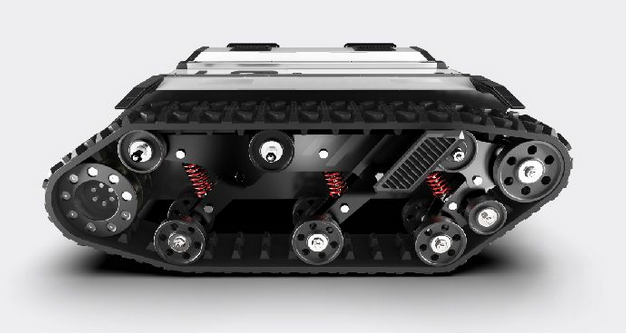

.. _BunkerGuide:

**Bunker**
=================

.. toctree::
   :hidden:
   :maxdepth: 1
   :glob:

   Bunker/BunkerSetup
   Bunker/GazeboBunkSim

BUNKER is an AgileX robot that adopts crawler-type differential mechanical mechanism, which has extremely strong terrain adaptability. It is specially designed for special working environment and features differential rotation, strong load capacity, small mechanical loss and high ingress protection rating.

Visit `AgileX <https://www.agilex.ai/index/product/id/9?lang=en-us>`_ for more information on the Bunker Robot.

