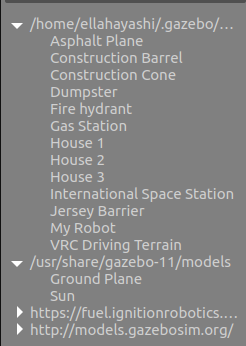

.. toctree::
   :hidden:
   :titlesonly:

Gazebo Basics
=============================

The basic's of Gazebo include understanding how to build modles and worlds in Gazebo. 

Creating a Model
---------------------------

1. Create a model directory:

.. code-block:: text

	mkdir -p ~/.gazebo/models/my_robot

2. Create a model config file:

.. code-block:: text

	gedit ~/.gazebo/models/my_robot/model.config

3. Paste in the following contents:

.. code-block:: text

	<?xml version="1.0"?>
	<model>
  		<name>My Robot</name>
  		<version>1.0</version>
  		<sdf version='1.4'>model.sdf</sdf>

  		<author>
   			<name>My Name</name>
   			<email>me@my.email</email>
  		</author>

  		<description>
    			My awesome robot.
  		</description>
	</model>

4. Create a ~/.gazebo/models/my_robot/model.sdf file.

.. code-block:: text

	gedit ~/.gazebo/models/my_robot/model.sdf

5. Paste in the following example modle of a simple two wheeled robot

.. code-block:: text
	:emphasize-lines: 5,8, 26, 55, 76, 97

	<?xml version='1.0'?>
	<sdf version='1.4'>
  		<model name="my_robot">
  
  			<!-- making the model dynamic -->
  			<static>false</static>
  
  			<!-- adding the rectangular base -->
          		<link name='chassis'>
            			<pose>0 0 .1 0 0 0</pose>
            			<collision name='collision'>
              				<geometry>
                				<box>
                  					<size>.4 .2 .1</size>
                				</box>
              				</geometry>
            			</collision>
            			<visual name='visual'>
              				<geometry>
                				<box>
                  					<size>.4 .2 .1</size>
                				</box>
              				</geometry>
            			</visual>
           
				<!-- adding sphere -->
          			<collision name='caster_collision'>
            				<pose>-0.15 0 -0.05 0 0 0</pose>
            				<geometry>
                				<sphere>
                					<radius>.05</radius>
              					</sphere>
            				</geometry>
            				<surface>
              					<friction>
                					<ode>
                  						<mu>0</mu>
                  						<mu2>0</mu2>
                  						<slip1>1.0</slip1>
                  						<slip2>1.0</slip2>
                					</ode>
              					</friction>
            				</surface>
          			</collision>
          		<visual name='caster_visual'>
            			<pose>-0.15 0 -0.05 0 0 0</pose>
            			<geometry>
              				<sphere>
                				<radius>.05</radius>
              				</sphere>
            			</geometry>
          		</visual>
      			</link> 

      			<!-- left wheel -->
      			<link name="left_wheel">
        			<pose>0.1 0.13 0.1 0 1.5707 1.5707</pose>
        			<collision name="collision">
          				<geometry>
            					<cylinder>
              						<radius>.1</radius>
              						<length>.05</length>
           					</cylinder>
          				</geometry>
        			</collision>
        			<visual name="visual">
          				<geometry>
            					<cylinder>
              						<radius>.1</radius>
              						<length>.05</length>
            					</cylinder>
          				</geometry>
        			</visual>
      			</link>

      			<!-- right wheel -->
      			<link name="right_wheel">
        			<pose>0.1 -0.13 0.1 0 1.5707 1.5707</pose>
        			<collision name="collision">
          				<geometry>
            					<cylinder>
             	 					<radius>.1</radius>
            	  					<length>.05</length>
            					</cylinder>
          				</geometry>
        			</collision>
        			<visual name="visual">
          				<geometry>
           					<cylinder>
            	  					<radius>.1</radius>
             						<length>.05</length>
            					</cylinder>
          				</geometry>
        			</visual>
      			</link>

      			<!-- joints connecting wheels to body-->
      			<joint type="revolute" name="left_wheel_hinge">
        			<pose>0 0 -0.03 0 0 0</pose>
        			<child>left_wheel</child>
        			<parent>chassis</parent>
        			<axis>
          				<xyz>0 1 0</xyz>
        			</axis>
      			</joint>

      			<joint type="revolute" name="right_wheel_hinge">
        			<pose>0 0 0.03 0 0 0</pose>
        			<child>right_wheel</child>
        			<parent>chassis</parent>
        			<axis>
          				<xyz>0 1 0</xyz>
        			</axis>
      			</joint>

  		</model>
	</sdf>

	
6. Run gazebo

.. code-block:: text

	gazebo

7. On the left menu bar, navigate to Insert/My Robot, and then place you're robot in you're gazebo world. 

8. Navigate the gazebo environment with holding left click for ajusting view, and scrolling on the mouse wheel for zoom.

9. Click on the dots to the right of the screen and drag them to the left. Under 'Force' tab, increase force applied to each joint to about 0.1N-m

.. raw:: html

	

		<video controls src="../_static/gazeboSim1.mp4" width="600"> </video>
	

|

Creating an Environment
------------------------------

Creating a simple environment in Gazebo is very easy with the librarie's and tools inside the Gazebo simulation. Open up a new Gazebo session and start adding in shapes to the environment

1. The top bar navigation contains a square, sphere and cilindar shapes that can be added to the newly created world. The top bar also includes tools to adjust the shapes size, position and orientation. 

.. image:: navigationTop.png
	:width: 700
	:alt: Directory Layout
	:align: center

2. On the left navigation bar under the 'Insert' tab, there is a library of objects you can add to the world.

3. Here is an example of adding in objects and shapes to an empty world.

.. raw:: html

	

		<video controls src="../_static/worldCreation.mp4" width="600"> </video>
	

	
4. Delete models by selecting them and hitting the 'Delete' key

5. Save a world with 'Save World As' and choose sdf file option

6. Load a world with the command line

.. code-block:: text

	gazebo my_world.sdf

