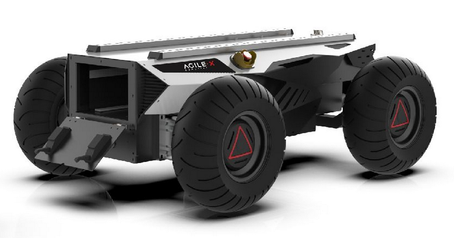

.. _HunterGuide:

**Hunter**
=================

.. toctree::
   :hidden:
   :maxdepth: 1
   :glob:

   Hunter/GazeboHuntSim

Hunter is an AgileX Robot designed for Low-speed Autonomous Driving scenarios. It leverages front-wheel ackerman steering and rocker suspension to cope with obstacles along its way. The new-generation power system offers better payload capacity and longer endurance. The revolutionary design of battery bin enables a quick-change process. It comes with the CAN\232 interface for secondary development.

Visit `AgileX <https://www.agilex.ai/index/product/id/9?lang=en-us>`_ for more information on the Hunter Robot.

