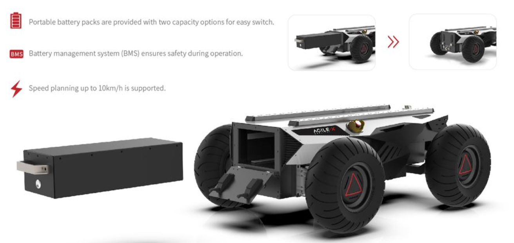
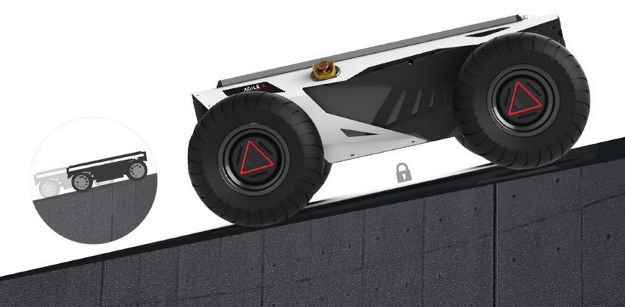
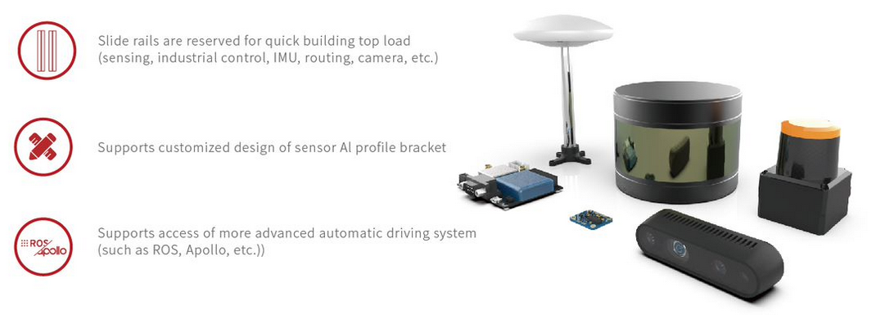
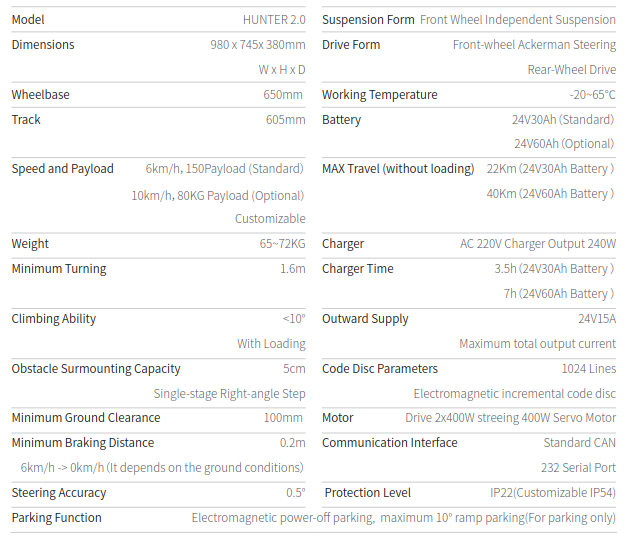
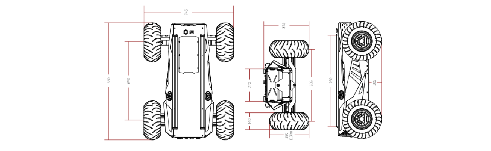

.. toctree::
   :hidden:
   :titlesonly:

About Hunter
========================

HUNTER2.0 was born for low-speed self-driving which based on front-wheel 
Ackerman steering theory and swing arm suspension, is able to pass different kind 
of obstacles, secondary development interfaces and standard installation 
components are making HUNTER2.0 the best solution for mobile robot self-
driving program. Compared with HUNTER1.0, the upgraded version HUNTER2.0 
has gradient parking function which achieved long-term ramp parking. If the 
vehicle is powered off or malfunctions while driving on a sloped road, the tires will 
be locked, making it stable and reliable. HUNTER2.0 has lithium iron phosphate 
battery and the capacities can be customized based on the requirement. The 
speed also can be customized up to 10km/h, meet the requirements of different 
autonomous driving scenarios. 

Battery
-----------

The Hunter 2.0 battery pack is lithium iron phosphate-based, offering flexible configuration to meet your task-based capacity needs. Customized speed planning up to 10km/h is available to meet the needs in various autonomous driving scenarios and support a wide set of use cases for industrial-grade robotics

Power System
-------------------

The Hunter 2.0 continues the simple and elegant look of the Hunter series with all-steel body, 400w dual servo motor drive, independent front wheel steering and robust, precisely controlled power system to support smooth running, whether indoors or outdoors. 

.. image:: hunt2.png
	:width: 700
	:alt: Directory Layout
	:align: center

Safe Power-off Parking
------------------------------

Hunter 2.0's slope parking feature allows a reliable standstill on a slope, thanks to the well-designed drive train. In the event of power outage or failure of the vehicle while traversing slope terrains, wheels will be locked in place without slipping off to ensure stable and reliable safety performance

Development
---------------------------------------------

Hunter can be customized for a variety of advanced operation modes (remote driving/automatic driving). Users can communicate with the main control through CAN bus protocol. Hunter also provides open-source SDK and ROS_PACKAGE, and its structural scheme is currently adapted to the most automatic driving schemes.

Specifications
----------------------------

Video of Hunter
------------------------------

.. raw:: html

	

		<video controls src="../_static/huntVid1.mp4" width="600"> </video>
	

|

.. raw:: html

	

		<video controls src="../_static/huntVid2.mp4" width="600"> </video>
	

|

Getting Started
----------------------

.. raw:: html

	

		<video controls src="../_static/huntVid3.mp4" width="600"> </video>
	

	

