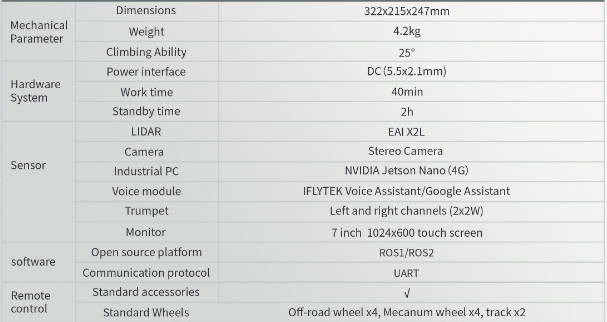

.. toctree::
   :hidden:
   :titlesonly:

About Limo
========================

The Limo is a new AgileX robot with a Touch Screen, Trumpet, WIFI, Infared Camera, Wheel-Motor Integration, NVIDIA jetson nano, and One key LiDAR switch. 

Steering
----------------------

The Limo has the option between 4 different types of steering, Ackermann steering, Four-wheel Differential steering, Tracked steering, and Omni Wheel steering.

.. raw:: html

	

		<video controls src="../_static/limoSteering.mp4" width="600"> </video>
	

|

Infared Camera
----------------------

The Limo has an attached Infrared Camera, allowing the user see the energy of objects through their device.

.. raw:: html

	

		<video controls src="../_static/IRLimo2.mp4" width="600"> </video>
	

|

Specifications
---------------------------

|

Video of Limo
----------------------------

.. raw:: html

	

		<video controls src="../_static/limoVid1.mp4" width="600"> </video>
	

|

.. raw:: html

	

		<video controls src="../_static/limoVid2.mp4" width="600"> </video>
	

