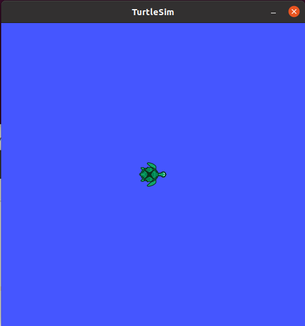
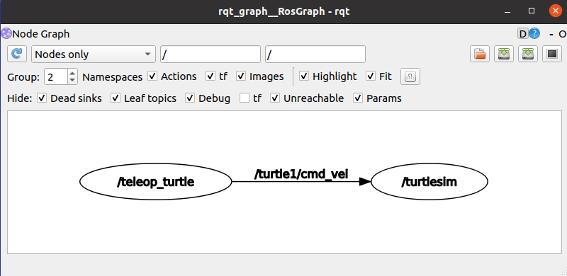
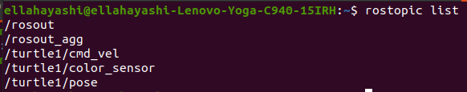

.. toctree::
   :hidden:

Tutorial/Demonstration
========================

We will be demonstrating Turtlesim, an in ROS example, demonstrating the functionality of ROS. This tutorial is meant to give users an understanding of how ROS nodes work, and how to debut their future projects.

If its not already installed:

.. code-block:: text
	:caption: turtlesim:

	sudo apt-get install ros-noetic-turtlesim
	
**1.** launch ROS master in seperate new terminal

.. code-block:: text

	roscore

**2.** View the available turtlesim nodes

.. code-block:: text

	rosrun turtlesim

you should see the following list of nodes
	* draw_square
	* mimic
	* turtlesim_node
	* turtle_teleop_key

We will want to run the turtlesim_node to start

**3.** Run the turtlesim_node

.. code-block:: text

	rosrun turtlesim turtlesim_node

The command should open a seperate window containing a blue background with a turtle icon in the middle. This node controls the GUI.

We are going to now start a new node that controls the movment of this turtle

**4.** Open a new terminal to start a new node. We want the node that controls the key movement of the turtle. Start the turtle_teleop_key node

.. code-block:: text

	rosrun turtlesim turtle_teleop_key

This node controls the key movement of the turtle. Press the arrow keys to direct the turtle, leaving a white line behind his path.

.. image:: turtle.gif
	:width: 200
	:alt: Directory Layout
	:align: center	

**5.** Open up a seperate terminal and see the active nodes in session

.. code-block:: text

	rosnode list

This command should open up a list showing you the active nodes. In this case we should see the two nodes teleop_turtle node and the turtlesim node that we started

.. image:: rosnode_list.png
	:width: 500
	:alt: Directory Layout
	:align: center

**6.** If you would like to see information on a specific node, use the rosnode info command

.. code-block:: text

	rosnode info /turtlesim
	
This will give you alot of information on the node including publication and subscription information.

**7.** Run the rqt graph to node visualization

.. code-block:: text

	rosrun rqt_graph rqt_graph

You should be able to see the two active nodes running, teleop_turtle and turtlesim. You can also see that they are talking on a topic /turtle1/cmd_vel. It seams from the graph that /teleop_turtle node is publishing to /turtlesim node.

**8.** View the active topics

.. code-block:: text

	rostopic list

Take note of turtle1/cmd_vel, turtle1/color_sensor, and turtl1/pose topics listed.

**9.** Find info on a topic

.. code-block:: text

	rostopic info /turtle1/cmd_vel

Executing this command, we can see the publisher and subscriber information on this topic. 

.. image:: topicinfo.png
	:width: 350
	:alt: Directory Layout
	:align: center

The subscriber is the turtlesim node, and the publisher is the teleop_turtle. This means that the turtlesim node waits for information from the teleop_turtle on the topic cmd_vel. In other words. The GUI waits for a command from the keyboard before moving the turtle on the GUI.

**10.** See active topic

.. code-block:: text

	rostopic echo /turtle1/cmd_vel

When executing this command, nothing happens. This is because it is a subscriber. In order to see the topic output, move the turtle with the arrow keys.

**11.** Check active services

.. code-block:: text

	rosservice list

Note the /reset service. What is this?

**12.** Get info on a service

.. code-block:: text

	rosservice info /reset
	
the reset service gives us information on node and type of service. In /reset service, we can see the message type is Empty and it takes no arguments

**13.** Call a service

.. code-block:: text

	rosservice call /reset "{}"

calling this service with the empty paramaters, we can see what this service does to the turtlesim GUI. Once executing we can see the turtle moves back to it's original location, in the center without any trace marks.

	

