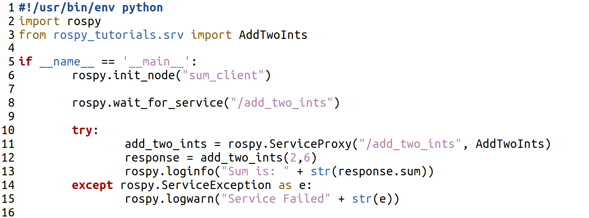
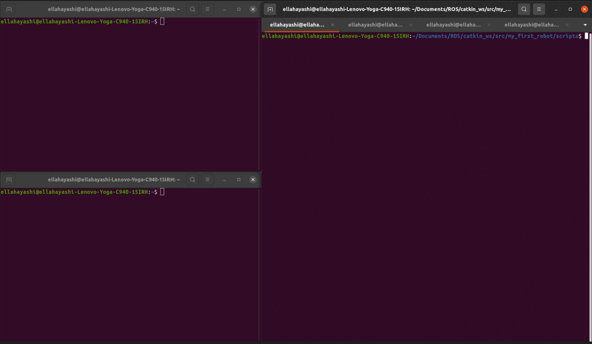

.. toctree::
   :hidden:

Service Client
================

**WHAT IS A ROS CLIENT**

A ROS client is a node that makes requests to a service server. It sends the server information, and then waits for a responce from the server. It uses srv topic to communicate. The client in this example is a sum of two numbers example, where the server adds two numbers, and the client sends two numbers to be added, and waits for the responce. 

**CREATE A ROS CLIENT**

Below is a template for Client code. Save this code in the scripts section of you're catkin package. The client template shows a client that given two numbers two a server. The server will return the sum of the two numbers to the client.

In the code we are adding two numbers 2 and 6 to get a sum of 8. The client sends the numbers to the server, the server does a computation, then returns the results. If we run our Sum server as created before, we can see the following output.

