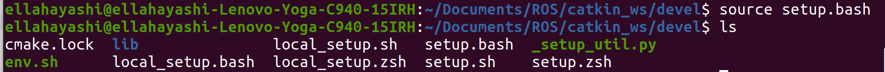

.. toctree::
   :hidden:

.. role:: underline
    :class: underline

Catkin Workspace
=========================

**WHAT IS A CATKIN WORKSPACE**

Catkin is the official build system for ROS. You will use it everytime you need to build your ROS application.

**CREATE CATKIN WORKSPACE**

To create a Catkin workspace please make sure you are in your home directory, or the directory that you choose to create your ROS program. Create a new directory (We recomend naming the directory catkin_ws). You also want to create a src folder inside you're newly created catkin folder.

Inside the catkin directory, execute the command 'catkin_make'. This will build you a new ROS work environment. 

Now if you list all inside the catkin directory (using ls), you should see the created 'src' folder, a 'build' folder, and a 'devel' folder

 
.. image:: isCatkin.png
	:width: 700
	:alt: Directory Layout

The last step to set up this catkin directory is to enter into the devel folder (cd devel). Once inside the devel folder you can see that there is a setup.bash file. In order to set up this working directory you type the command "source setup.bash".

	
Alternatively, instead of manually doing this step for every new environment, we can type this command into the bashrc script. We have also showed this step in the 'ROS Installation' page for reference.

