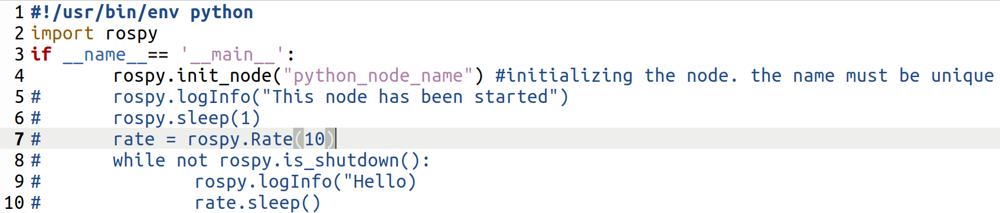

.. toctree::
   :hidden:
   

ROS Node
=========================

**WHAT IS A NODE**

A node is a process that performs computation. A node is an executable program inside the Robot. There are many nodes inside one robot, and they all communicate with eachother. Nodes are an extreamly useful functionality of ROS as they reduce code complexity for the developer.

A package as discussed, is an independent unit inside of a robot. A package is empty however, and you need to create nodes inside packages before anything can happen. For example, if a robot has a camera package, where the package handles the camera operations as an independent unit from the others, you can create nodes inside this package. The camera package needs a driver node, as well as an image processing node. The nodes communicate using ROS communication functionalities. You can also have nodes from seperate packages communicate with eachother as well. For example, the image processing node may send data to a motion planning package node.

**CREATE PYTHON NODE**

Create a new directory called scripts in your robot package, and this is where you will create your first python node in.

.. image:: firstNode.png
	:width: 700
	:alt: setup.bash

You can now open up your new python file in any text editor you want, and use python to write you're node functionalities. Please review the following template for the node python file

The basic python script shows beginner levle ROS Node functionalities. 

1. essential for setting up noetic environment!
2. essential for importing ROS packages
3. The main function of the ROS Node
4. Initializing your Node (Essential)
5. logging info to the terminal output. use this to interact with the node
6. forces function to 'sleep' before moving onto next line of code
7. creating a mathematical time called rate
8. while the node is still active. Entering into a loop like this means it will keep the node active until the user shuts down the node themselves with ctr C
9. printing a "Hello" into terminal. In the while loop this means that it will be printed in a loop
10. using the rate time to sleep before re-entering the loop

**NOTE**

Before executing your node, you must run the ros master in another script. to run this, type roscore and have it running on the side. Then return to your terminal and run your python file with 'python my_first_node.py'

