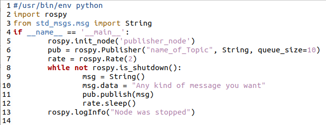

.. toctree::
   :hidden:

Publisher
================

**WHAT IS A ROS PUBLISHER**

A ROS Publisher is a node that publishes a specific type of ROS message over a given ROS topic. Subscriber nodes can access these messages if they are interested in the same topic. For example, a radio transmitter publishes music on a frequency that is accessed by the topic, a radio station. Subscribers from home can access this by tuning into that radio station. This is the general principle behind ROS publishers.

**CREATE A ROS PUBLISHER**

Creating a publisher is easy. The publisher is going to be a python file created in the scripts folder of your chosen ROS package. The following picture is a template of what a publisher could look like. 

Similar to the regular node, we simply add a publisher class (called 'pub' in the example script). We give the publisher class the name of our desired topic, along with message type (String), and queue size (to tighten the feed if we want something smaller).

.. image:: publisher.gif
	:width: 700
	:alt: Directory Layout

