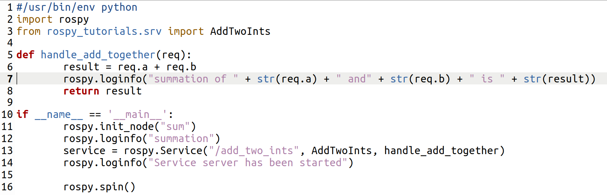

.. toctree::
   :hidden:

Service Server
==================

**WHAT IS A ROS SERVER**

A ROS service server holds the information for a requesting service client. It waits for a request on a specific service, and will spend back a response to the client. For example, if a client sends the server two numbers, a server can reply with the sum of those two numbers.

**CREATE A ROS SERVER**

Below is a template for Server code. Save this code in the scripts section of you're catkin package. The server template shows a server that given two numbers from a client, will return the sum of those two numbers. the srv used is handle_add_together. 

Running this code, the output should look like the following:

.. image:: server.gif
	:width: 700
	:alt: Directory Layout

