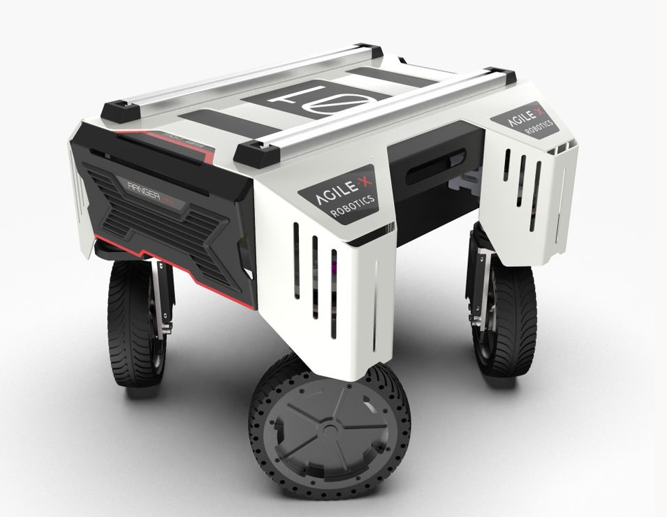

.. _RangerMGuide:

**Ranger Mini**
=================

.. toctree::
   :hidden:
   :maxdepth: 1
   :glob:

   Ranger_Mini/about
   Ranger_Mini/GazeboRangSim
   Ranger_Mini/purchas

Ranger Mini is an AgileX Robot with new omni-directional UGV created by AgileX Robotics, and based on new four-wheel and four-turn control theory, it adopts independent drive module design with integrated drive and steering. It has a variety of flexible drivingmodes and combing powerful maneuverability and flexibility, to bring more possibilities for mobile robot platforms for different applications.

Visit `AgileX <https://www.agilex.ai/index/product/id/9?lang=en-us>`_ for more information on the Ranger Mini Robot.

