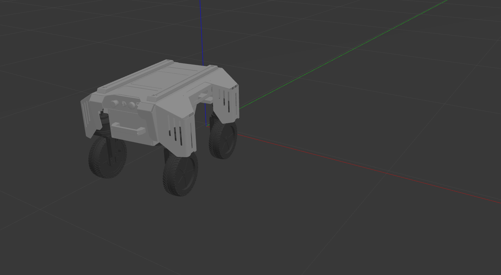

.. toctree::
   :hidden:
   :titlesonly:

Gazebo Simulation
=============================

The Gazebo simulation lets you interact with the Robot modle inside of Gazebo without having the robot in real life. 

Requirments
--------------------

You need to have **Gazebo** and **ROS** downloaded before executing any of the commands. Visit our ROS and Gazebo pages for information on how to install.

Please execute the following code blocks in a new Terminal window to simulate these products

.. code-block:: text
	:caption: ros-control function package:

	sudo apt-get install ros-noetic-ros-control
	

.. code-block:: text
	:caption: ros-controllers function package:

	sudo apt-get install ros-noetic-ros-controllers

.. code-block:: text
	:caption: gazebo-ros function package:

	sudo apt-get install ros-noetic-gazebo-ros

.. code-block:: text
	:caption: gazebo-ros-control function package:

	sudo apt-get install ros-noetic-gazebo-ros-control..

.. code-block:: text
	:caption: rqt-robot-steering plug-in:

	sudo apt-get install ros-noetic-rqt-robot-steering 

.. code-block:: text
	:caption: keyboard controller:

	sudo apt-get install ros-noetic-teleop-twist-keyboard 

|

AgileX Workspace
------------------------------

In order to run the simulations, you will need the entire AgileX workspace. Open up a terminal. Navigate to the place you would like to store your AgileX simulation folder and execute the following commands in order. 

1. Create a new directory for your workspace

.. code-block:: text

	mkdir AgileX_ws

2. Enter AgileX_ws folder

.. code-block:: text

	cd AgileX_ws
	
3. Create a src folder

.. code-block:: text

	mkdir src
	
4. Enter src folder

.. code-block:: text

	cd src

5. Initialize catkin folder

.. code-block:: text

	catkin_init_workspace

6. Clone git simulation model package

.. code-block:: text

	git clone https://github.com/agilexrobotics/ugv_gazebo_sim.git

8. Enter AgileX_ws folder

.. code-block:: text

	cd ..	

9. Compile

.. code-block:: text

	catkin_make

|

Ranger Mini Simulation
-----------------------------

1. Enter AgileX_ws folder (if not already in the AgileX_ws folder)

.. code-block:: text

	cd AgileX_ws

2. Declare environment variables

.. code-block:: text

	source devel/setup.bash
	
3. Simulate

.. code-block:: text

	roslaunch ranger_mini_gazebo ranger_mini_empty_world.launch

A Gazebo simulation environment with the Ranger robot should appear

4. Drive Ranger

Use the Ackerman_steering_controller window to control the movement of the robot. The vertical bar acts as the forward, backwards movement needed to boost the robot into motion, while the horizontal bar controls the direction the robot accelerates in.

.. image:: steering.png
	:width: 500
	:alt: Directory Layout
	:align: center

|

5. Ranger Simulation

.. raw:: html

	

		<video controls src="../_static/ranger.mp4" width="600"> </video>
	

	

	
