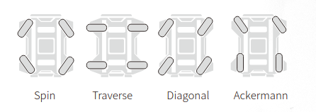

.. toctree::
   :hidden:
   :titlesonly:

About Ranger Mini
========================

The Ranger Mini is a compact robot with adjustable wheel directions to achieve spin in place functionality, traverse, and diagonal movement. It also has climbing ability for real world use, and can carry up to 50kg payload. As a UGV with superb flexibility and performance, Ranger Mini combines the obstacle-climbing ability of the Scout with the high load capacity and long battery life of the Hunter. Swing arm suspensions and higher ground clearance bring a fresh movement experience for indoor and outdoor work. 

Four Modes
-------------------

The Ranger Mini is omnidirectional and features a compact body and zero turning radius to achieve 360 degree static steering. It supports Spin, Traverse, Diagonal, and Ackermann modes.

	

Battery
-------------------

The run time of Ranger Mini lasts up to 5 hours, and the battery is an easy to use removable design. 

.. image:: rangerpic1.png
	:width: 600
	:alt: Directory Layout
	:align: center
	

Specifications
-----------------------

.. image:: rangerSpecifications.png
	:width: 700
	:alt: Directory Layout
	:align: center
	
|

Video of Ranger Mini
-----------------------------
	
.. raw:: html

	

		<video controls src="../_static/rangerMinivid1.mp4" width="600"> </video>
	

	
	
	
	
	
	
	
	
	
	
	
