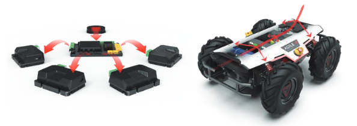
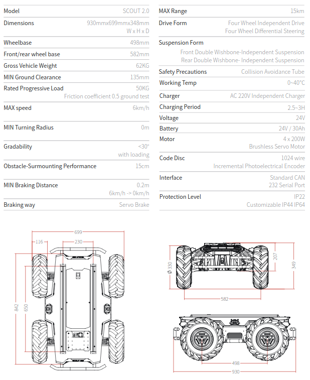

.. toctree::
   :hidden:
   :titlesonly:

About Scout 2.0
=============================

Scout is an outdoor chassis designed for industrial applications. Scout 2.0 has remolded structure design and newly upgraded cooling system and safety systems. The compact design has independent suspention that can adapt to various rugged paths; the zero turning radius can easily control the narrow environment; and the standardized protocols facilitate rapid secondary development. 

Structure
-------------------------

The core of the structural design of the Scout is always compact. Under the premise of guaranteed function, the body size of Scout 2.0 is reduce by 25% from that of scout 1.0, adding infinite possibility to its application environment. The Scout also has four-wheel drive features. Each wheel adopts independent 200w brushless servo motor and adopts double-transverse arm independent suspention, which can greatly improve the adaptability of the body to the terrain while ensuring the power and ensuring the stability and anti-interference ability of the load. As a result, it can easily surmount 10cm obstacles and work easily in the outdoor.

.. image:: scoutpic1.png
	:width: 500
	:alt: Directory Layout
	:align: center

Cooling System
----------------------------------

The Scout 2.0 has an upgraded cooling system with internal and external circulation. The heat conduction module is provided with directional cooling for driving module and power units. Under the premsi of ensuring the IP level of protection of the body, a strong fan module is provided, effictively improving the operating duration of the chassis and adapting to the high-temperature environment. There are also real-time temperature monitoring and other security measures, providing more secure and reliable protection for the chassis in real time.

.. image:: scoutpic2.png
	:width: 500
	:alt: Directory Layout
	:align: center

Supported Development
-------------------------------

the Scout has independent main control systems, and can accomplish its own motion control with a customized complex operation mode. The master control provides serial port / standard CAN busbar as the communication interface and provides open source SDK and ROS_PACKAGE. Aditionally a bus interace is reserved around the body, and the top design with standard aluminum profiles which is convenient for customers to match and access to external equipment such as differential GPS, binocular camera, laser radar, infrared / ultrasonic obstacle avoidance sensor, etc,. This allows customers to complete customizeation for in-depth secondary development. The Scout also supports access to more advanced self-driving systems, such as ROS, Baidu Apollo, etc.

	
|

.. image:: scoutpic4.png
	:width: 700
	:alt: Directory Layout
	:align: center

Specifications
-------------------------------

Video of Scout
--------------------------------

.. raw:: html

	

		<video controls src="../_static/scoutvid1.mp4" width="600"> </video>
	

|

.. raw:: html

	

		<video controls src="../_static/scoutvid2.mp4" width="600"> </video>
	

|

Getting Started
---------------------------------------

.. raw:: html

	

		<video controls src="../_static/scoutGS.mp4" width="600"> </video>
	

