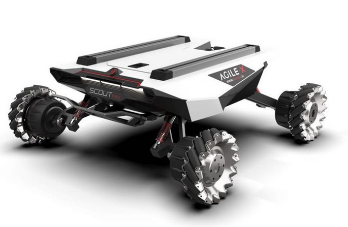

.. _ScoutMGuide:

**Scout Mini**
=================

.. toctree::
   :hidden:
   :maxdepth: 1
   :glob:
   
   Scout_Mini/ScoutM_Setup

SCOUT MINI is an AgileX robot with all-terrain high-speed mini UGV and four-wheel differential drive, independent suspension, in-situ differential rotation and other features. Thanks to the independently developed lightweight power system solution so that SCOUT MINI has a maximum speed of 10 km/h, which is an all-around mobile research platform specially designed for cutting-edge scientific experiments.

Visit `AgileX <https://www.agilex.ai/index/product/id/9?lang=en-us>`_ for more information on the Scout Mini Robot.

