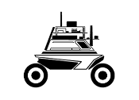

Robot Documentation
======================

.. toctree::
   :caption: Software
   :maxdepth: 2
   :hidden:

   Prerequisites
   ROS
   Gazebo

.. toctree::
   :caption: AgileX
   :maxdepth: 2
   :hidden:
   
   Requirments
   Hunter
   Limo
   Scout
   Ranger_Mini
   Tracer
   
.. image:: robot.png
	:width: 200
	:alt: Directory Layout
	:align: left

.. image:: operate.png
	:width: 235
	:alt: Directory Layout

Our documentation website contains information on our software we use to execute our robots, and our AgileX products. 

**Software**

Our software documentation used includes information on Python3, the Robotic Operating System and Gazebo simulation tool. We included guides and tutorials on how to use these software. User's following these examples will have an understanding of how we build our robots, as well as understand how we test our products.

**AgileX**

Our AgileX products are listed under the AgileX feild and include descriptions on the robots as well as a demonstration on how to simulate their function in Gazebo. User's can test out our products on their own and see working versions of these robots in Gazebo. Knowledge of how to install and run Gazebo is found under our software feild.

**Resources**

- Visit `ROS home page <https://www.ros.org/>`_ for more information on ROS
- Visit `Gazebo home page <http://gazebosim.org/>`_ for more information on Gazebo
- Visit `AgileX <https://www.agilex.ai/index/product/id/9?lang=en-us>`_ for more information on AgileX robots.
- Visit `Indro Robotics home page <https://indrorobotics.ca/>`_ for more information on the company 

